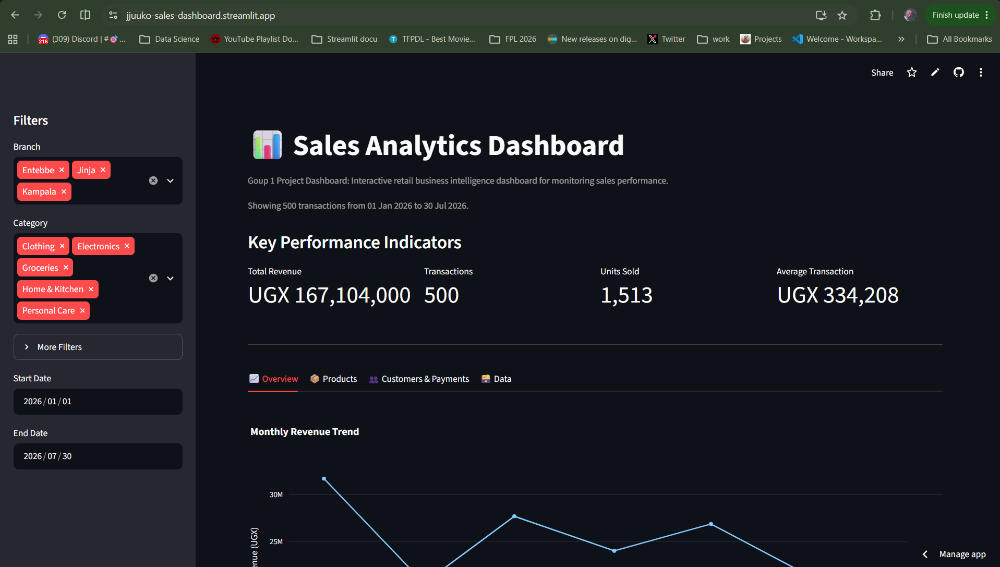

# Sales Analytics Dashboard

An interactive retail sales analytics dashboard built using Python, Pandas, Plotly and Streamlit.

## Project Overview

This project analyses retail sales data and provides an interactive dashboard for monitoring business performance.

The dashboard allows users to filter sales records and explore key performance indicators, product performance, branch performance, customer behaviour and payment methods.

## Live Dashboard

The deployed dashboard can be accessed here:

[Open the Sales Analytics Dashboard] (https://jjuuko-sales-dashboard.streamlit.app/)

## Dashboard Preview


## Features

- Total revenue analysis
- Transaction tracking
- Units sold analysis
- Average transaction value
- Monthly revenue trends
- Revenue by branch
- Revenue by category
- Product performance analysis
- Customer type analysis
- Payment method analysis
- Interactive filters
- Filtered CSV downloads

## Technologies Used

- Python
- Pandas
- Plotly
- Streamlit
- Jupyter Notebook
- Git
- GitHub

## Project Structure

```text
sales_analytics_dashboard/
│
├── data/
├── notebooks/
├── images/
├── app.py
├── generate_data.py
├── requirements.txt
├── README.md
└── .gitignore

Running the Application

Install the required packages:

pip install -r requirements.txt

Run the Streamlit application:

streamlit run app.py
Dataset

The project uses simulated retail sales transaction data created for learning and demonstration purposes.

Author

Deogratius Jjuuko

## Current Status

The dashboard currently supports interactive sales analysis, filtering, product analysis, customer analysis and CSV exports.